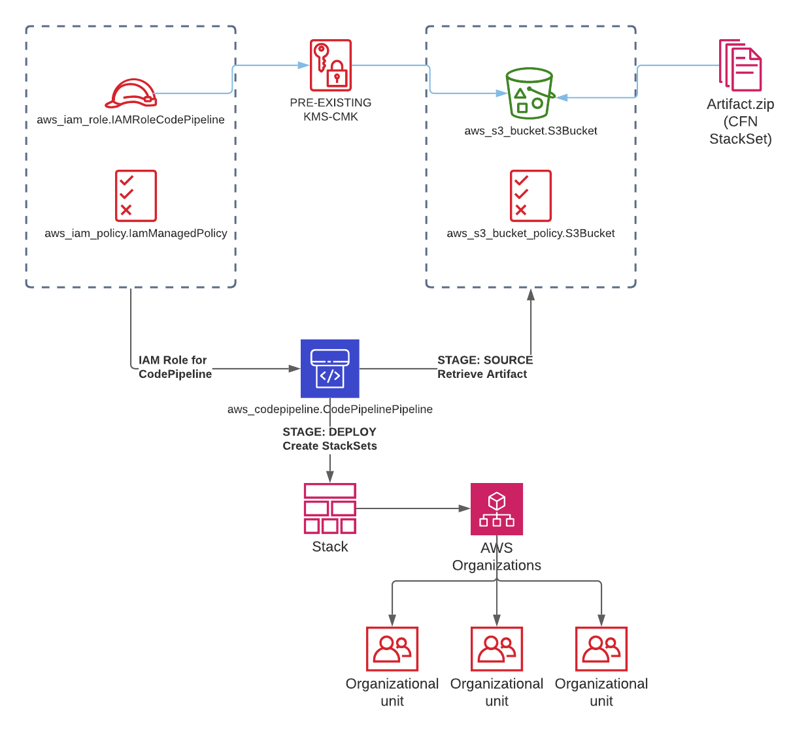

# Terraform Managed CloudFormation Pipeline

## Overview

The Terraform Managed Cloudformation Pipeline deploys a set of resources to enable provisioning of CloudFormation Stacksets.

CloudFormation Stacksets are utilized for resources that are deployed evenly across the AWS Landing Zone's Organization structure, either to OU's or to all OU's via the Root ID.

Whilst Terraform does support the ability to deploy StackSets, it does not fully provide (version 0.14) the ability deploy a StackSet into a target OU or Organization Root.

## Design

Terraform deploys the required IAM Role for the CodePipeline job to run, along with the required IAM Policy.

The S3 Bucket is provisioned, with default block public access, and applied KMS CMK Encryption Key.



The CloudFormation Template that is regularly deployed into the StackSets deployment service must be packed as a CloudFormation Template that will deploy a StackSets resource.  

The design of the AWS CloudFormation StackSet template, is outside of the scope of this project.  The deployment artifact that is referenced by the Deploy stage is simply a CloudFromation Template in zip form.

## Deployment and Use

  - [1 Parameters - tfvars](#1-parameters---tfvars)
  - [2 Deploy Terraform](#2-deploy-terraform)
  - [3 Deploy ZIP Artifact for StackSets](#3-deploy-zip-artifact-for-stacksets)
  - [4 Update KMS Encyrption Keys](#4-update-kms-encyrption-keys)

### 1 Parameters - tfvars

Example use of tfvars file configuration of parameters below;

```
s3_kms_key = {
    alias = "myKMSCMKkey",
    arn   = "arn:aws:kms:ca-central-1:123456789012:key/a12bf3c4-5678-9d0e-123f-45a6789b0123"
}
```

```
# log_bucket = {
#     name  = string,
#     id    = string
# }
```

```
standard_tags = {
    owner           = "firstname.lastname@emaildomain.com",
    classification  = "unclassified",
    solution        = "my-stackset-tool"
    deployment      = "terraform",
    deploy-date     = "2021-03-08",
    category        = "automation"
}
```

```
department = {
    lowercase   = "myco-aws",
    uppercase   = "MYCO-AWS"
}
```

```
codepipeline_project_variables = {
    projectname       = "my-cool-stackset-tool",
    projectnameshort  = "cooltool",
    stacksetname      = "my-cool-tool",
    templatepath      = "00-stackset.yml",
    pipelineiampolicy = ["arn:aws:iam::aws:policy/AdministratorAccess"],
    artifactzip       = "my-cool-tool.zip"
}
```

```
codepipeline_project_capabilities = "CAPABILITY_AUTO_EXPAND,CAPABILITY_IAM,CAPABILITY_NAMED_IAM"
```

```
provider_variables = {
    region      = "ca-central-1",
    access_key  = "",
    secret_key  = "",
    token       = ""
}
```

### 2 Deploy Terraform

Perform a **terraform plan** to verify the changes, and then **terraform apply** to deploly

Ensure that this is performed either from the 'Master Root Account' of the Organization, or that there is sufficient trust within AWS Organizations and AWS CloudFormation for StackSets to properly execute.

### 3 Deploy ZIP Artifact for StackSets

This can be performed manually by zipping up your CloudFormation Stackset template, or with an external pipeline that process that for you and copy to the S3 bucket.

The zip file should be copied to the newly created S3 bucket into a directory with the following naming;
+ *${var.codepipeline_project_variables.projectnameshort}/${var.codepipeline_project_variables.artifactzip}* 
  
With our example variables, this will be;
+ cooltool/my-cool-tool.zip
+ s3://myco-aws-123456789012-my-cool-stackset-tool/cooltool/my-cool-tool.zip

### 4 Update KMS Encyrption Keys

In this template we reference an already provisioned AWS Key Management Service (KMS) Customer Managed Key (CMK) for accessing the S3 bucket.  Management of the existing KMS CMK Key is outside of the scope of this project, and can be performed manually by adding the ARN for the CodePipeline key (**resource "aws_iam_role" "IAMRoleCodePipeline"**) to the KMS CMK Policy covering use **"Action": ["kms:Encrypt","kms:Decrypt","kms:ReEncrypt*","kms:GenerateDataKey*","kms:DescribeKey"]**

## Reference Information

For further information on configuration parameters and attribuets for CodePipeline;

+ [CodePipeline S3 Source](https://docs.aws.amazon.com/codepipeline/latest/userguide/action-reference-S3.html)
+ [CloudFormation StackSets](https://docs.aws.amazon.com/codepipeline/latest/userguide/action-reference-StackSets.html)
+ [Terraform CodePipeline](https://registry.terraform.io/providers/hashicorp/aws/latest/docs/resources/codepipeline)

The included reference CloudFormation Tempalte is the AWS Instance Scheduler, and is provided purely for test purposes.
[AWS Instance Scheduler](https://aws.amazon.com/solutions/implementations/instance-scheduler/)